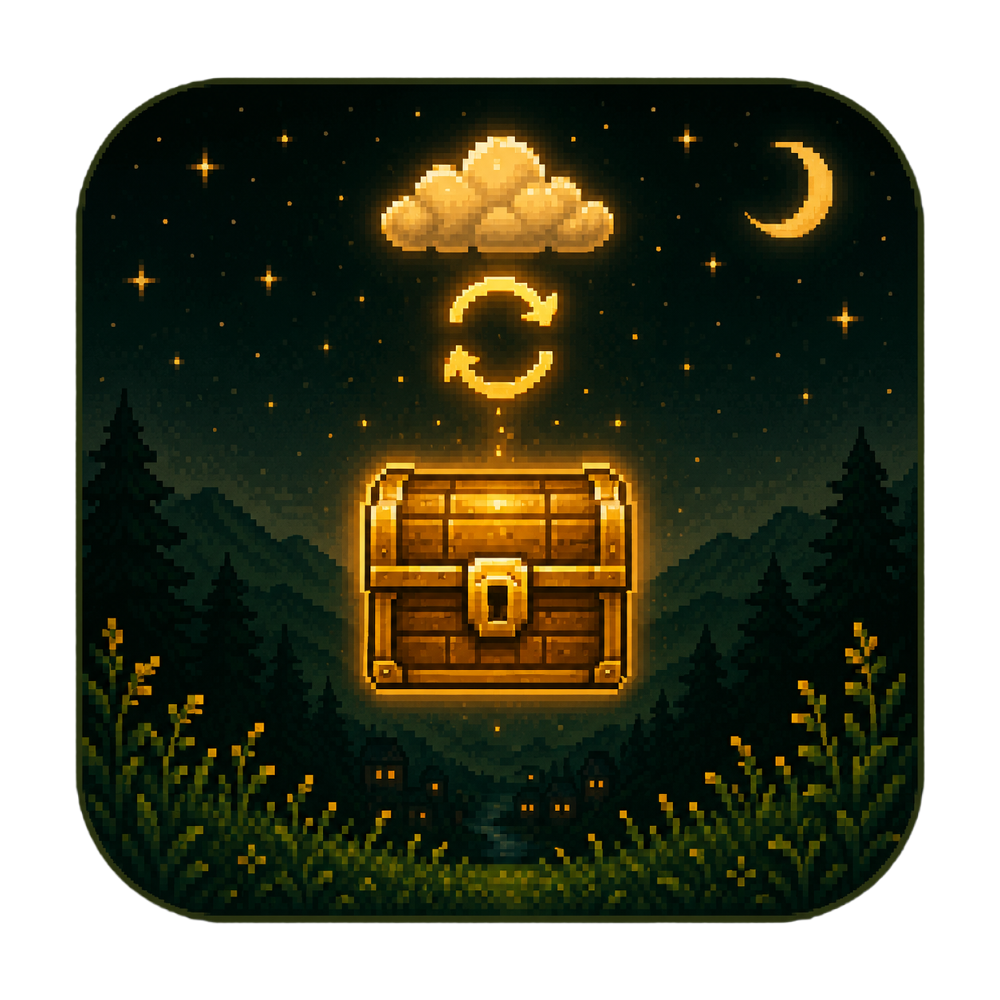

<div align="center">



# ValleySave

**Синхронизируйте сохранения Stardew Valley между Windows, macOS, Linux и Android — через ваш собственный Google Drive.**

Без сторонних серверов. Без подписок. Без слежки. Ваши сохранения никогда не покидают ваш аккаунт Google.

[](https://github.com/hirieo/valleysave-app/releases/latest)
[](https://github.com/hirieo/valleysave-app/releases)
[](../../LICENSE)

[](https://ko-fi.com/hirieo)

[🇬🇧 English](../../README.md) · [🇪🇸 Español](README.es.md) · [🇫🇷 Français](README.fr.md) · [🇩🇪 Deutsch](README.de.md) · [🇮🇹 Italiano](README.it.md) · [🇵🇹 Português](README.pt.md) · [Euskera](README.eu.md) · 🇷🇺 Русский · [🇺🇦 Українська](README.uk.md) · [🇯🇵 日本語](README.ja.md) · [🇰🇷 한국어](README.ko.md) · [🇨🇳 中文](README.zh.md) · [🇹🇼 中文（繁體）](README.zh-Hant.md) · [🇹🇭 ไทย](README.th.md)

</div>

---

> [!IMPORTANT]
> **ValleySave находится в раннем доступе.** Экран входа через Google всё ещё ожидает проверки со стороны Google, поэтому пока подключаться могут только аккаунты Google из белого списка. Чтобы получить доступ, напишите на **lhirieo@gmail.com**, указав аккаунт Google (email), который будете использовать с ValleySave. Приложение станет доступно всем сразу после завершения проверки Google.

## Что такое ValleySave?

В Stardew Valley нет официальной облачной синхронизации сохранений между ПК и мобильными устройствами. **ValleySave решает эту проблему**: приложение находит ваши фермы, загружает их в папку `ValleySave/` в **вашем собственном Google Drive** и позволяет скачать их и продолжить игру на любом другом устройстве — Windows, macOS, Linux или Android.

- 🔒 **Приватность прежде всего** — используется ограниченный scope Google `drive.file`: приложение видит только файлы, созданные им самим, и никогда — остальное содержимое вашего Drive.
- 🖥️ **По-настоящему кроссплатформенно** — одна кодовая база (Flutter), нативные сборки для всех четырёх платформ.
- 🌍 **14 языков** — русский, английский, испанский, баскский, французский, немецкий, итальянский, португальский, украинский, японский, корейский, китайский (упрощённый и традиционный) и тайский.

## Возможности

### Синхронизация и перенос сохранений
- **Автоматическое обнаружение ферм** — находит сохранения на любой платформе, включая Steam (нативный, Flatpak и Snap в Linux) и защищённую папку `Android/data` на Android (режимы root, [Shizuku](https://shizuku.rikka.app/) или ручной мост).
- **Загрузка и скачивание в один клик** — каждая ферма показывает, какая сторона новее (локальная или Drive), и рекомендует нужное действие.
- **Защита от неполных сохранений** — сохранение с недостающими файлами в Drive помечается и не может быть скачано наполовину.

### Безопасность данных (то, чем мы гордимся больше всего)
- **Транзакционная замена** — каждое скачивание, импорт и восстановление проходит через конвейер *подготовка → проверка → резервная копия → замена → верификация* с автоматическим откатом. Если ПК зависнет посреди скачивания, оригинальное сохранение останется нетронутым или будет автоматически восстановлено.
- **Атомарные загрузки** — данные загружаются в новую неизменяемую папку «поколения» и публикуются одним финальным обновлением манифеста. Другие устройства никогда не увидят наполовину загруженное сохранение.
- **Автоматические резервные копии с ротацией** — перед любой заменой создаётся проверенная копия; хранятся последние 5 автоматических копий на ферму (ручные не удаляются никогда).
- **Восстановление после сбоев** — временные папки прерванной операции обнаруживаются и безопасно разрешаются при следующем запуске, всегда в пользу валидной копии.

### Кооперативная игра
- **Смена хоста** — передайте роль хоста кооперативной фермы другому игроку внутри файла сохранения с полной проверкой целостности до и после. Играйте на той же ферме, даже когда обычный хост отсутствует.
- **Делитесь фермами с друзьями** — поделитесь фермой через Drive, чтобы другие игроки могли скачать её и продолжить игру, с бейджами ролей (только чтение или синхронизация).
- **Карточки со всеми игроками** — кооперативные фермы показывают всех фермеров, а не только хоста.

### Удобство
- **Запуск игры из приложения** — находит и запускает Stardew Valley в Windows, macOS и Linux (Steam нативный / Flatpak / Snap).
- **Импорт сохранений из .zip** — с той же транзакционной защитой, что и при скачивании.
- **Встроенное обновление** — проверяет GitHub Releases и скачивает новую версию за вас.
- **Сезонный интерфейс** — весь интерфейс следует сезону в игре: лепестки весной, светлячки летом, листья осенью, снег зимой.

## Загрузки

Скачайте последнюю версию со страницы **[Releases](https://github.com/hirieo/valleysave-app/releases/latest)**:

| Платформа | Файл | Примечания |
|---|---|---|
| **Windows** | `ValleySave-Setup-*.exe` | Установщик — VC++ runtime включён, 14 языков |
| **Windows** (портативная) | `ValleySave-*-windows.zip` | Распаковать и запустить |
| **macOS** | `valleysave-macos.zip` | Распаковать, переместить в Программы |
| **Linux** (Ubuntu/Debian) | `valleysave_*_amd64.deb` | Двойной клик для установки — со значком в меню |
| **Linux** (портативная) | `valleysave-linux-x64.tar.gz` | Распаковать и запустить, любой дистрибутив |
| **Android** | `ValleySave-*.apk` | Android 8+ |

> [!NOTE]
> **📱 iOS:** Уже готово. Не хватает только 99 USD в год, которые Apple берёт за публикацию — [поддержите на Ko-fi](https://ko-fi.com/hirieo), и iOS присоединится к вечеринке.
>
> Уже 7 месяцев я почти каждый день работаю над ValleySave. Утренний кофе правда помогает взбодриться — даёт энергию продолжать этот проект и то, что будет дальше. ☕

## Как это работает

1. **Подключите** — привяжите свой аккаунт Google (OAuth, только scope `drive.file`).
2. **Обнаружьте** — ValleySave автоматически найдёт ваши фермы.
3. **Синхронизируйте** — загрузите фермы в папку `ValleySave/` вашего Drive.
4. **Продолжайте где угодно** — установите ValleySave на другое устройство, подключите тот же аккаунт, скачайте и играйте.

## Частые вопросы

**Есть ли в Stardew Valley официальные облачные сохранения между ПК и мобильными?**
Нет — сохранения хранятся локально, официальной кроссплатформенной синхронизации не существует. ValleySave обеспечивает её через ваш собственный Google Drive.

**Мои сохранения в безопасности?**
Каждая разрушительная операция транзакционна: оригинал резервируется и проверяется перед заменой и автоматически восстанавливается при сбое.

**Где хранятся мои сохранения?**
В папке `ValleySave/` внутри *вашего собственного* Google Drive. Сервера ValleySave не существует.

**Можно ли перенести ферму между Windows и Android?**
Да — это основной сценарий. Также macOS и Linux, в любом направлении.

## Сборка из исходников

Требования: [Flutter](https://docs.flutter.dev/get-started/install) ≥ 3.12 · Android Studio (для Android)

```bash
git clone https://github.com/hirieo/valleysave-app.git
cd valleysave-app

flutter pub get
cp .env.example .env
# Desktop: заполните GOOGLE_CLIENT_ID и GOOGLE_CLIENT_SECRET в .env
flutter run
```

## Лицензия

[Polyform Noncommercial 1.0.0](../../LICENSE) — можно читать код, учиться на нём и вносить вклад; коммерческое использование требует явного разрешения.

Распространяется **без каких-либо гарантий**. Используйте на свой риск.
